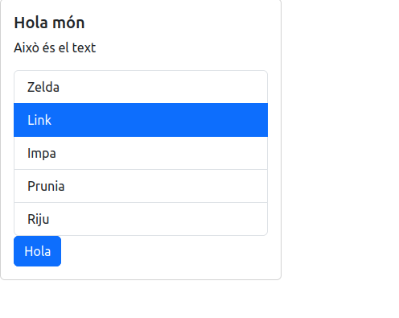
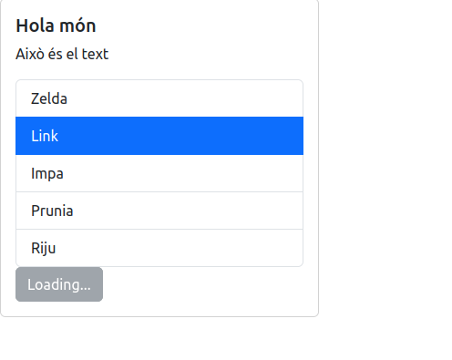
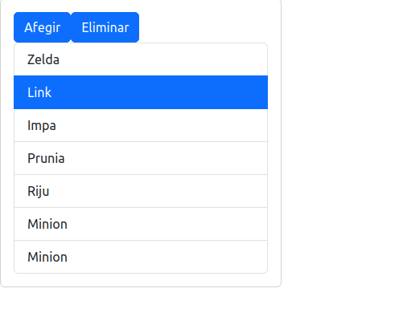

## 1. Què és React i per què l’utilitzem?
React és una biblioteca JavaScript per construir interfícies d’usuari basades en **components**.

Avantatges principals:
- Permet dividir la UI en peces reutilitzables.
- Facilita la gestió d’estat i la reactivitat.
- Ajuda a organitzar projectes més complexos.
- És molt utilitzat en el sector professional.

Aquest bloc introdueix React per preparar l’alumnat pel projecte final del mòdul.

---

## 2. Crear un projecte React amb Vite
Vite permet crear projectes React de dues maneres: **amb plantilla directa** o **amb menú interactiu**.

### 🔹 Opció A — Crear projecte amb menú interactiu (també vàlid)
Si no especifiques plantilla, Vite et mostrarà un menú perquè triïs framework i variant:
```bash
npm create vite@latest
```
El menú et demanarà:
1. **Nom del projecte** (si no el passes com a argument)
2. **Framework** → tria: `React`
3. **Variant** → tria:
   - **`JavaScript` (React JS)** (Opció recomanada)
   - `JavaScript-SWC` (React JS amb SWC, més ràpid)
   - `TypeScript` (React TypeScript)
   - Altres (les veurem més endavant)
4. **Rolldown**: (No, per defecte)
5. **Instal·lació i arrancada automàtica**: Instal·la dependències i arrenca el servidor de desenvolupament  

### 🔹 Opció B — Crear projecte amb plantilla (recomanat per evitar errors)
```bash
npm create vite@latest my-app -- --template react
```
Aquesta opció demanarà les opcions 4 i 5 de l'opció A de forma interactiva de totes maneres. 


> 💡 Tant l’opció A com l’opció B activen el suport per JSX automàticament. No cal configurar Babel manualment.

### Crear projecte 

```bash
npm create vite@latest 
```
Segueix el menu interactiu i si has dit que no volies l'opció 5, hauràs de fer:
```
cd <nom-del-projecte>
npm install
npm run dev
```

Vite és una eina de desenvolupament ràpida, senzilla i ideal per introduir React.

### Fitxers rellevants
- `package.json` — dependències i scripts
- `vite.config.js` — configuració del projecte
- `index.html` — punt inicial on React injecta l’aplicació
- `src/` — codi principal

---
### Exemples de classe
[Exemple aplicació amb React](my-first-app/): A classe hem anat desenvolupant un projecte bàsic de React on a través dels diferents *commits* hem vist des de la creació de components, passar propietats entre components, gestió d'esdeveniments i estat i renderitzat condicional.  

#### Components rellevants: 
- Card
- List
- CardBody  
#### Propietats (props):
- paràmetres: title, text,...
- children: quan un component pot tenir components fills
- funcions: passar funcions com a propietats: *OnSelect*

#### Esdeveniments
Gestió d'esdeveniments predefinits com **onClick** i maneig amb **handleClick**

#### Gestió d'estat (useState)
```jsx
const [variable,setVariable]=useState(valorInicial);
```
[React API Reference - useState](https://react.dev/reference/react/useState)

#### Renderitzat condicional
Mostrar contingut segons variables:
```jsx
list.length !== 0 && (
    <List data={list} onSelect={handleSelect} />
```

[Exemple Botó amb canvi segons estat](button-example/): Exercici de classe on el botó canvia de contingut i estil segons l'estat  



[Exemple Afegir i eliminar elements](add-delete-example//): Exercici de classe on el podem afegir o eliminar contingut a una llista.   


