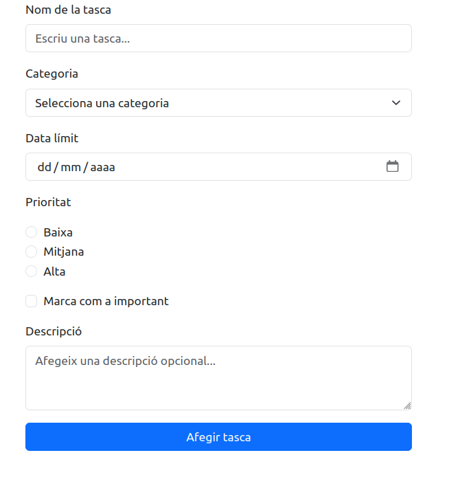
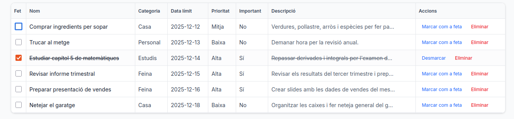

# Tema 2 - Pt1: Gestor de Tasques amb React
- [Tema 2 - Pt1: Gestor de Tasques amb React](#tema-2---pt1-gestor-de-tasques-amb-react)
  - [Objectiu de la pràctica](#objectiu-de-la-pràctica)
  - [Exemples d'implementació UI](#exemples-dimplementació-ui)
  - [Camps del formulari i validacions obligatòries](#camps-del-formulari-i-validacions-obligatòries)
    - [**1. Nom de la tasca** (`taskName`)](#1-nom-de-la-tasca-taskname)
    - [**2. Categoria** (`taskCategory`)](#2-categoria-taskcategory)
    - [**3. Data límit** (`taskDueDate`)](#3-data-límit-taskduedate)
    - [**4. Prioritat** (`taskPriority`)](#4-prioritat-taskpriority)
    - [**5. Important** (`taskImportant`)](#5-important-taskimportant)
    - [**6. Descripció** (`taskDescription`)](#6-descripció-taskdescription)
  - [Funcionament mínim que ha de tenir l'aplicació](#funcionament-mínim-que-ha-de-tenir-laplicació)
    - [✔ **Crear tasques**](#-crear-tasques)
    - [✔ **Llistar tasques**](#-llistar-tasques)
    - [✔ **Marcar com a feta / desfer**](#-marcar-com-a-feta--desfer)
    - [✔ **Eliminar tasques**](#-eliminar-tasques)
  - [Estructura del projecte](#estructura-del-projecte)
  - [README: Què ha de contenir](#readme-què-ha-de-contenir)
  - [Criteris d'avaluació orientatius](#criteris-davaluació-orientatius)
    - [Fins a 7 punts](#fins-a-7-punts)
    - [**Fins a 3 punts extres (opcions)**](#fins-a-3-punts-extres-opcions)
  - [Lliurament](#lliurament)
  - [Requisits per agilitzar el testeig i preparació de l'entorn](#requisits-per-agilitzar-el-testeig-i-preparació-de-lentorn)
    - [✔ Fitxers que han d’estar disponibles](#-fitxers-que-han-destar-disponibles)
    - [✔ Configuració mínima de l'entorn](#-configuració-mínima-de-lentorn)
    - [✔ Indicació visual de formulari validat](#-indicació-visual-de-formulari-validat)
    - [✔ Carregar dades de prova](#-carregar-dades-de-prova)
    - [1) Confirmació visual / console.log en enviar](#1-confirmació-visual--consolelog-en-enviar)
    - [2) Dades de prova (seed) per al llistat](#2-dades-de-prova-seed-per-al-llistat)
    - [3) Proves unitàries suggerides (opcions mínimes)](#3-proves-unitàries-suggerides-opcions-mínimes)
      - [Exemple breu (React Testing Library)](#exemple-breu-react-testing-library)
  - [✔ Recordatori per a l'estudiant](#-recordatori-per-a-lestudiant)

##  Objectiu de la pràctica
Construir una aplicació senzilla de **Gestor de Tasques** utilitzant:
- **React + Vite** per al frontend
- **Bootstrap** per a l'estil visual (o altres)
- **React Hook Form (RHF)** per a la gestió del formulari
- **Zod** per a les validacions
- **localStorage** per guardar les dades de manera persistent

L'aplicació ha de permetre:
1. **Crear una tasca** mitjançant un formulari validat
2. **Llistar totes les tasques creades**
3. **Marcar una tasca com a feta** (toggle)
4. **Eliminar una tasca**
5. **Persistir les dades** a `localStorage` perquè no es perdin en refrescar la pàgina

---

## Exemples d'implementació UI
*Possible mockup del formulari*


*Possible mockup del llistat*


---

## Camps del formulari i validacions obligatòries
El formulari ha d'incloure els següents camps i complir **totes** les validacions indicades:

### **1. Nom de la tasca** (`taskName`)
- Tipus: text
- Validacions:
  - Obligatori
  - Mínim **5 caràcters**

### **2. Categoria** (`taskCategory`)
- Tipus: select
- Opcions mínimes:
  - "Personal"
  - "Casa"
  - "Feina"
  - "Estudis"
- Validacions:
  - Obligatòria
  - Valor ha de pertànyer a una de les categories predefinides

### **3. Data límit** (`taskDueDate`)
- Tipus: date
- Validacions:
  - Obligatòria
  - Data **posterior** a la data actual
  - Ús recomanat de `z.coerce.date()`

### **4. Prioritat** (`taskPriority`)
- Tipus: radio group
- Valors possibles:
  - "baixa"
  - "mitja"
  - "alta"
- Validacions:
  - Obligatòria

### **5. Important** (`taskImportant`)
- Tipus: checkbox
- Validacions:
  - Cap (opcional)

### **6. Descripció** (`taskDescription`)
- Tipus: textarea
- Validacions:
  - Opcional
  - Màxim **300 caràcters** 

---

##  Funcionament mínim que ha de tenir l'aplicació
Per obtenir la qualificació base (fins a 7 punts), l'aplicació ha de complir:

### ✔ **Crear tasques**
- Formulari de creació de tasques
- Afegir-les a un array
- Validacions actives amb missatges d'error

### ✔ **Llistar tasques**
- Mostrar nom, categoria, data, prioritat, important, descripció


### ✔ **Marcar com a feta / desfer**
- Canviar l'estat de la tasca amb un botó o checkbox

### ✔ **Eliminar tasques**
- Botó que les elimina de la llista i del localStorage


---

##  Estructura del projecte
Organitza el projecte utilitzant components reutilitzables:

- `Input`
- `Select`
- `RadioGroup`
- `Textarea`
- `TaskList`
- ...

Tenir un schema Zod:
- `taskSchema.js`

I opcionalment:
- components d'error com `ErrorMessage`

---

##  README: Què ha de contenir
Cada alumne ha d'incloure un README amb:
- Descripció de l'aplicació
- Captura del resultat final
- Explicació breu de com executar el projecte
- Funcionalitats implementades
- Recursos utilitzats, biblioteques i fonts d'informació 
- Passos seguits per la implementació del projecte (bitàcola)
- (Opcional) Millores afegides més enllà del mínim requerit

---

##  Criteris d'avaluació orientatius
Els punts següents són orientatius i serveixen perquè l'alumne entengui què es valora:

###  Fins a 7 punts 
- Formulari complet i validat amb Zod
- Creació de tasques funcional
- Llistat visible i correcte
- Marcat/Desmarcat com a fet
- Eliminació funcional
- Una mínima componentització
- README complet i screenshot

### **Fins a 3 punts extres (opcions)**
- Filtres (per categoria o estat)
- Ordenació (per data o prioritat)
- Cerca de tasques
- Exportar/Importar tasques en JSON
- Confirmació d'eliminació amb modal
- Persistència al localStorage
- Altres


---


## Lliurament
L'alumne ha de lliurar:
1. Enllaç al repositori o ZIP del projecte (sense node-modules)
2. README complet
---
## Requisits per agilitzar el testeig i preparació de l'entorn

### ✔ Fitxers que han d’estar disponibles
L’alumnat ha d'incloure en el projecte:
- Un fitxer de dades de prova: `src/data/seedTasks.json` (estructura d'una llista de tasques).
- Components separats per al formulari i la llista: `TaskForm.jsx`, `TaskList.jsx`, `TaskItem.jsx`.
- Un schema de validació Zod: `taskSchema.js`.
- Arxiu principal: `App.jsx` i estructura habitual de Vite.

### ✔ Configuració mínima de l'entorn
S'ha d'assegurar que:
- El projecte s'executa amb `npm install` i `npm run dev`.
- Hi ha suport per a **React Hook Form**, **Zod** i `zodResolver`.
- Està configurat **Bootstrap** (o altres) per a l'estilització.
- Els identificadors dels camps es diuen com es mostra a l'enunciat: `taskName`, `taskDescription`, `taskDueDate`, ...
- El navegador mostra un formulari funcional i una àrea on es llistaran les tasques.

### ✔ Indicació visual de formulari validat
Quan es fa `submit` del formulari i les dades són vàlides, l'alumnat ha d’implementar **una confirmació simple** com ara:
- Un `console.log(data)` de l'objecte final creat, **o**
- Mostrar temporalment les dades sota el formulari.

Aquest retorn serveix per verificar ràpidament que els camps estan validats i que el model de dades és correcte.

### ✔ Carregar dades de prova
L’alumnat ha de preparar el projecte perquè pugui carregar les dades del fitxer `seedTasks.json` **sense necessitat d'introduir tasques manualment**. Pot ser:
- Mitjançant un botó "Carrega dades de prova", **o**
- Automàticament si existeix una variable d'entorn com `VITE_USE_SEED=true`.

Aquesta funcionalitat permetrà testejar la llista de tasques d'una manera ràpida i fiable.

---
Per facilitar la correcció i les proves ràpides, afegeix els següents mecanismes al teu projecte (són **obligatoris** per obtenir la qualificació base i molt útils per a la correcció):

### 1) Confirmació visual / console.log en enviar
Quan l'usuari enviï el formulari i la validació sigui correcta, l'aplicació **ha d'indicar de manera clara** que s'han capturat bé les dades. Pots implementar **una o ambdues** de les opcions següents:
- **Console:** fer un `console.log(data)` amb l'objecte `task` que s'ha creat.
- **Fragment HTML:** mostrar temporalment (o de forma persistent) un petit fragment sota el formulari amb les dades capturades en format JSON o en HTML resumit (p.ex. títol, categoria, data).

Aquest comportament fa més fàcil verificar que la validació i el mapping de camps funcionen sense haver d'obrir DevTools si l'avaluador ho vol veure en pantalla.

### 2) Dades de prova (seed) per al llistat
Implementa un mecanisme per carregar un fitxer de dades de prova (p.ex. `src/data/seedTasks.json`) amb una llista d'objectes `task` perquè es puguin omplir la llista sense passar pel formulari. Requisits mínims:
- El fitxer `seedTasks.json` ha d'estar en format JSON amb un array d'objectes que segueixen l'estructura `task` definida a l'enunciat.
- A l'arrencada de l'aplicació, si existeix una variable d'entorn (`VITE_USE_SEED=true`) o una opció de la UI (`Carrega dades de prova`) s'haurà de carregar aquest fitxer i injectar les tasques al `localStorage` o directament a l'estat per veure el llistat.

Això permet a l'avaluador i a tu mateix provar el rendering de la llista i les interaccions (marcar/eliminar) sense haver d'afegir manualment cada registre.

### 3) Proves unitàries suggerides (opcions mínimes)
Si vols fer proves automàtiques, aquestes són les recomanacions mínimes amb *React Testing Library* + *Jest* (o l'entorn de testing que prefereixis):

- **Test 1:** Renderitza `TaskForm`, omple els inputs vàlids i fa `submit`. Assert: `onSubmit` s'ha cridat (o el `localStorage` s'ha actualitzat).
- **Test 2:** Renderitza `TaskList` amb dades de prova (mocked). Assert: els títols de les tasques s'estan mostrant i el nombre d'elements és correcte.
- **Test 3:** Simula clicar `Eliminar` i comprova que l'element ha desaparegut del DOM i del `localStorage`.

#### Exemple breu (React Testing Library)
```js
import { render, screen, fireEvent } from '@testing-library/react';
import TaskForm from '../components/TaskForm';

test('submit form calls onSubmit with valid data', () => {
  const handle = jest.fn();
  render(<TaskForm onSubmit={handle} />);

  fireEvent.change(screen.getByLabelText(/Nom de la tasca/i), { target: { value: 'Prova' } });
  fireEvent.change(screen.getByLabelText(/Categoria/i), { target: { value: 'personal' } });
  fireEvent.change(screen.getByLabelText(/Data límit/i), { target: { value: '2099-01-01' } });

  fireEvent.click(screen.getByRole('button', { name: /afegir tasca/i }));

  expect(handle).toHaveBeenCalled();
});
```

---

## ✔ Recordatori per a l'estudiant
L'objectiu d'aquesta pràctica és:
- Dominar formularis amb React Hook Form
- Aprendre a validar amb Zod
- Gestionar estat i componentització
- Persistir dades al navegador
- Escriure documentació tècnica


>Nota: Aquest document pot ser actulatizat per redefinir criteris o afegir guies 